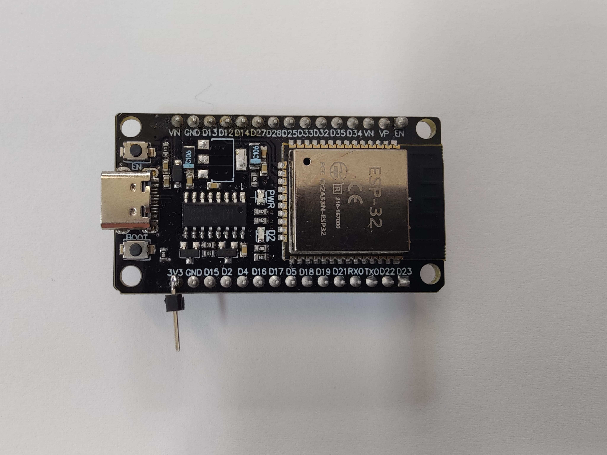
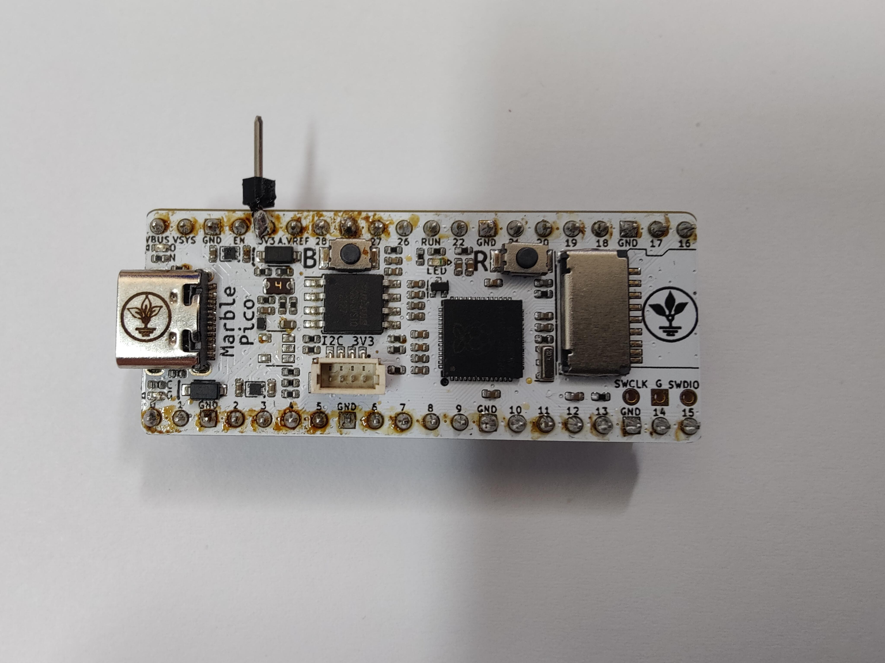
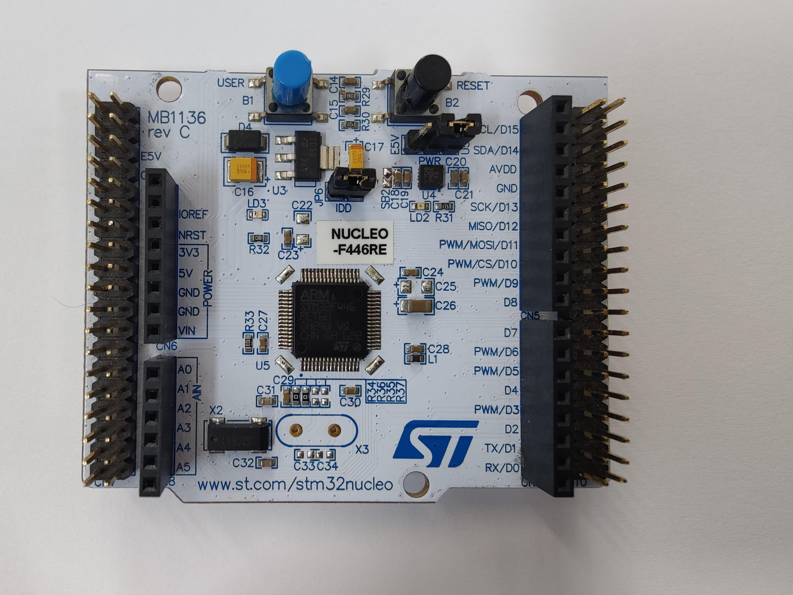
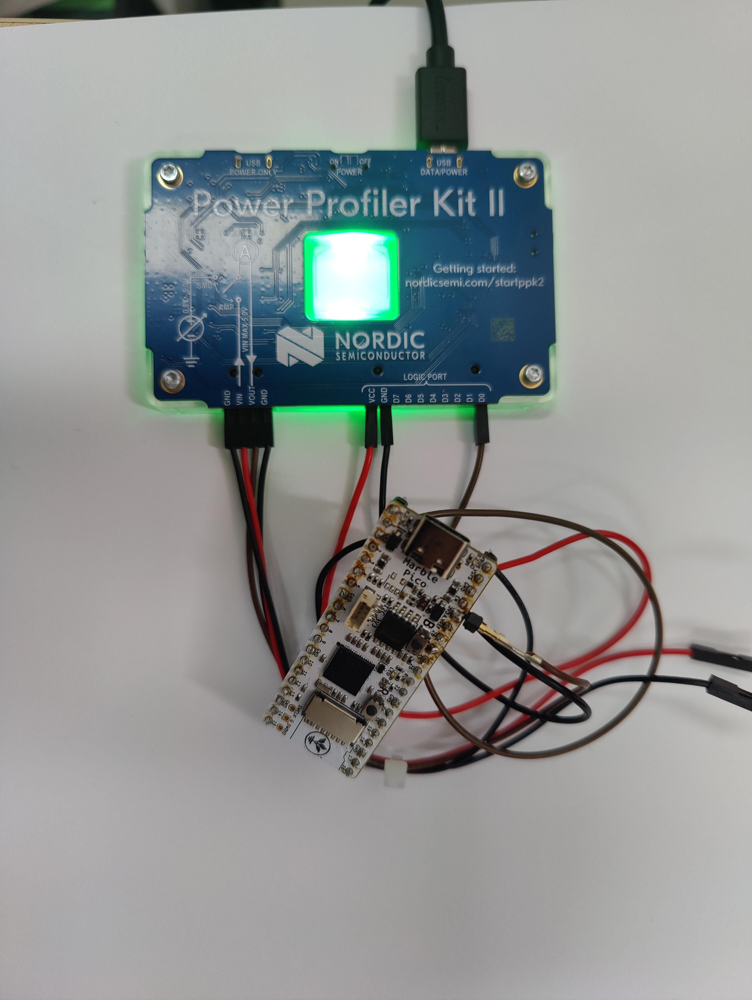

# Energy Profiling

Firmware and offline analysis for measuring ESP32, RP2040 and **NUCLEO-F446RE** workloads with Nordic PPK2. Release **v1.2.0** adds a **common 160 MHz comparison** (`energy-profiling-v5-common160`) alongside the maximum-clock experiment (`energy-profiling-v4-max-clock`, originally released as v1.1.0). Both use experiment schema 2 and one digital output to mark the twelve fixed-count workload batches; the algorithm is inferred from pulse order.

The default remains **max_clock**, so existing acquisition commands keep their current meaning. Select **common160** explicitly for the new comparison. See the [160 MHz configuration and campaign guide](docs/COMMON_CLOCK_160.md), [its exact image manifest](profiles/common160/CURRENT_FIRMWARE.json) and the [release downloads](https://github.com/victorstoica114/energy-profiling/releases/tag/v1.2.0). All three boards require ten new captures at 160 MHz; these data are separate from the maximum-clock campaign.

The common C library executes twelve algorithms on identical inputs across boards, retaining the repetition counts documented in the original experiment. Native adapters use ESP-IDF, Pico SDK and STM32 CMSIS. The firmware does not calculate algorithm duration or energy.

| Platform | Maximum-clock experiment | Required operating configuration |
|---|---:|---|
| ESP32-D0WD-V3 | 240 MHz | One application core; Wi-Fi and Bluetooth uninitialized |
| RP2040, Marble Pico | 200 MHz | Internal core regulator 1.15 V; QSPI Flash 50 MHz |
| NUCLEO-F446RE | 180 MHz | Scale 1 and OverDrive; internal HSI-derived PLL |

These are the configured maximum CPU operating profiles. They do not imply that every bus, external Flash or hardware accelerator is used at its maximum. **The maximum-clock campaign is complete: 30 accepted captures, ten per board.** It combines ten retained ESP32 captures at 240 MHz with their original v3 experiment, image and acquisition provenance, and twenty new v4 captures for RP2040 at 200 MHz and STM32F446 at 180 MHz. The [completed campaign](ROW_Data/source_campaign.json) pins every accepted capture and preserves the original records from source commit `7909bfd5966b0ecc976450e21fbe530d673d3ec1`. The common160 campaign requires separate new captures.

**Maximum-clock functional validation passed on RP2040 and STM32F446: all twelve workloads and final DONE.** The silent measurement images were programmed afterward. See the [hardware validation record](docs/HARDWARE_VALIDATION.md) for logs, register observations and image hashes. The subsequent maximum-clock PPK2 captures are included in the [accepted selection](ROW_Data/README.md).

**Common160 functional validation passed on all three boards: all twelve workloads with exact call counts and final DONE at the configured 160 MHz.** Their matching silent measurement images were installed afterward; common160 is the latest recorded installation on Pico, ESP32 and STM32F446. Separate diagnostic and programming evidence is retained for [Pico](hardware/common160/2026-09-11/rp2040_diagnostic_01.json) ([programming](hardware/common160/2026-09-11/rp2040_measurement_programming_01.json)), [ESP32](hardware/common160/2026-09-11/esp32_diagnostic_01.json) ([programming](hardware/common160/2026-09-11/esp32_measurement_programming_01.json)) and [STM32F446](hardware/common160/2026-09-11/stm32f446_diagnostic_01.json) ([programming](hardware/common160/2026-09-11/stm32f446_measurement_programming_01.json)). All three common160 PPK2 capture sets remain pending; programming observations do not independently validate the silent images' complete execution.

## Hardware used in the tests

The photographs show the three microcontroller boards and the Nordic Power
Profiler Kit II (PPK2) used for the measurements. Click any photograph to open
it at full resolution.

<table>
  <tr>
    <td align="center" width="50%">
      <strong>ESP32</strong><br>
      <a href="docs/images/hardware/esp32.jpg"></a><br>
      Classic ESP32 development board.<br>
      RUN output: GPIO18.
    </td>
    <td align="center" width="50%">
      <strong>RP2040 — Marble Pico</strong><br>
      <a href="docs/images/hardware/rp2040-marble-pico.jpg"></a><br>
      RP2040 board labeled Marble Pico.<br>
      RUN output: GP2.
    </td>
  </tr>
  <tr>
    <td align="center" width="50%">
      <strong>NUCLEO-F446RE</strong><br>
      <a href="docs/images/hardware/nucleo-f446re.jpg"></a><br>
      STM32F446 target board.<br>
      RUN output: PC0.
    </td>
    <td align="center" width="50%">
      <strong>PPK2 acquisition setup</strong><br>
      <a href="docs/images/hardware/ppk2-rp2040-setup.jpg"></a><br>
      Nordic PPK2 connected to the RP2040 board.<br>
      Current acquisition and digital RUN marker.
    </td>
  </tr>
</table>

The RP2040 board pictured above runs the repository's `rp2040` firmware target.
During energy acquisition, PPK2 supplies the DUT's 3.3 V rail and records the
single RUN signal on D0. The DUT's USB, UART adapter and programmer are
disconnected or electrically isolated; PPK2 remains connected to the acquisition
computer. See the [acquisition protocol](docs/PROTOCOL.md) for the wiring details.

## Documentation and source

- [Firmware specification](firmware/README.md): measurement behavior, compilation, inputs, algorithm contracts, memory, board configuration and measured boundaries.
- [Common 160 MHz comparison](docs/COMMON_CLOCK_160.md): supported clocks, internal supply settings, build selection, new images and thirty-capture campaign.
- [Experiment manifest](config/experiment.json): fixed order, repetitions, input size, target clocks, single output pin and pauses.
- [Autonomous runner](firmware/common/bench_runner.c) and [common kernels](firmware/common/kernels).
- [Board targets](firmware/targets) and [input manifest](data/manifest.json).
- [Acquisition protocol](docs/PROTOCOL.md) and [capture format and analyzer](docs/capture_format.md).
- [Original maximum-clock campaign plan](campaigns/MAX_CLOCK_CAMPAIGN.md): acquisition requirements and explicitly pinned ESP32 reuse. The [completed maximum-clock selection](ROW_Data/source_campaign.json) now records all 30 accepted captures.
- [Automated PPK2 collector](tools/capture_ppk2.py), which power-cycles one DUT, stops after the twelve D0 windows plus the required LOW tail, preserves raw transport/CSV, and runs the structural analyzer.
- [Build instructions](docs/BUILD_AND_TEST.md), [validation status](docs/VALIDATION.md) and [current hardware report](docs/HARDWARE_VALIDATION.md).
- [Historical initial 30-capture PPK2 campaign](results/2026-09-10_ppk2/README.md), with aggregate CSV/JSON and a hash-linked capture index.
- [Historical ESP32 no-regulator measurement update](results/2026-09-10_ppk2_esp32_noreg/README.md), with ten new cold-boot captures and a direct comparison against the original ESP32 fixture.
- [Historical regulator-removed campaign update](results/2026-09-10_ppk2_regulators_removed/README.md), combining the new ESP32 and RP2040 series with the unchanged STM32 series.
- [Historical raw-data inventory and reproduction guide](dataset/README.md), with a SHA-256 inventory of the earlier final, pilot, rejected and incomplete PPK2 transports.
- [Accepted maximum-clock CSV dataset](ROW_Data/README.md): published selection/index and original experiment profiles for 30 captures; full curated CSVs and unchanged sidecars remain local in ESP32, RP2040 and STM32F446 folders. Original source captures are archived separately.

The measurement image uses **`BENCH_DIAGNOSTICS=OFF`**. Application serial reporting is absent and UART/USB interfaces are disabled. During acquisition, the board runs autonomously with its USB, UART adapter and programmer disconnected. [CURRENT_FIRMWARE.json](CURRENT_FIRMWARE.json) records image hashes, build status and observed programming status separately. Maximum-clock images are archived under each target's `build_verified/max_clock_measurement`; common160 images and their separate manifest use `build_verified/common160_measurement` and `profiles/common160/CURRENT_FIRMWARE.json`. Earlier firmware remains available in the [v1.0.0 release archive](https://github.com/victorstoica114/energy-profiling/releases/tag/v1.0.0).

## Selected CSV data and article analysis

The accepted `ROW_Data/` dataset is stored locally at
`D:\Documente\Energy Profiling\ROW_Data`. Dataset
`2026-09-11_ppk2_max_clock_csv` contains ten captures per board: 30 full waveform
CSVs, 132,329,472 sample rows and 360 complete RUN windows. ESP32 retains its
10 September 2026 v3 captures; RP2040 and STM32 use new 11 September v4 captures.
The source archive is commit `7909bfd5966b0ecc976450e21fbe530d673d3ec1`.
The [completed campaign](ROW_Data/source_campaign.json),
[dataset manifest](ROW_Data/dataset_manifest.json) and
[capture index](ROW_Data/capture_index.csv) preserve the exact selection,
original profiles, candidate image hashes and acquisition provenance.

The published `ROW_Data/` contents are selection metadata, the capture index
and original experiment profiles. Full curated CSVs and copied acquisition
sidecars remain local under `ESP32/`, `RP2040/` and `STM32F446/`, each containing
`run_01/` through `run_10/`. These local run folders are ignored by Git to avoid
duplicating the source archive. Original RAW transports and acquisition
sidecars are published under `captures_noreg/` and `captures_max_clock/`;
Git LFS supplies RAW transports and the new maximum-clock source CSVs.
`tools/export_ppk2_raw.py` can reconstruct CSVs using each RAW capture's saved
calibration parameters. Compare complete CSV SHA-256 hashes with the index
before using reconstructed or copied files.

ESP32/Pico board regulators were removed. On STM32 the LDO remains fitted,
JP6 is open and PPK2 supplies the MCU VDD side of JP6. The completed campaign
records this operator correction separately from unchanged acquisition metadata;
the measured STM32 boundary is the supplied MCU VDD domain, not the whole board.

The preceding local selection is archived in
`ROW_Data_history/2026-09-10_ppk2_regulators_removed_csv`, also ignored by Git.
Historical result directories retain their original measurements and labels;
they are not the current maximum-clock article dataset.

The article keeps derived `data/`, generated tables/figures and analysis scripts
in its separate workspace. Those scripts use the sibling
`Energy Profiling/ROW_Data` directory by default, or `PPK2_DATA_DIR` when set.
Full waveform/hash validation and curation are complete. See the
[dataset README](ROW_Data/README.md) for columns, provenance and reconstruction.
The common160 capture campaign remains separate and pending.

## One measurement signal

| PPK2 input | Meaning | ESP32 | Pico RP2040 | NUCLEO-F446RE |
|---|---|---|---|---|
| D0 | RUN | GPIO18 | GP2 | PC0 |

Connect the selected MCU output to PPK2 D0, LOGIC VCC to the measured DUT 3V3 rail, and the grounds as specified in the [protocol](docs/PROTOCOL.md). In Source Meter mode, PPK2 VOUT supplies the board's 3V3 input. PPK2's own USB connection to the acquisition computer remains connected.

**HIGH marks one complete fixed-count kernel batch; LOW is outside the batch.** There are no additional algorithm-ID, error, completion or idle-validity outputs. Only D0 is interpreted by the analyzer; other PPK2 digital inputs are unused.

## Autonomous sequence

```text
boot, platform initialization/checks and first input preparation
  -> RUN LOW: nominal 5 s active control idle
  -> RLE -> Delta -> LZ77 -> Huffman -> AES -> SHA -> ChaCha -> CRC -> FFT -> FIR -> IIR -> DCT
  -> after final verification: nominal 2 s active control idle, RUN LOW
  -> platform final state, RUN remains LOW until reset
```

Each arrow between algorithms contains result verification, preparation of the next workload and a nominal 1 s active idle pause. Each algorithm produces exactly one HIGH pulse containing its configured number of independent calls. There is no extra 1 ms ID-settling delay. The initial 5 s starts after initialization and the first preparation, so power-on boot time is additional.

A detected fault latches the same RUN output **HIGH until reset**. Missing falling edges, extra pulses and incomplete sequences cause structural rejection. With one wire, a LOW tail cannot by itself prove that final verification finished, and some resets or hangs can be indistinguishable from an otherwise valid pulse sequence. Capture acceptance is a structural check, not an independent firmware attestation.

Start recording before powering the DUT and keep at least **3 s of LOW after the twelfth falling edge**. The baseline is the last 2 s before the first rising edge. The analyzer checks lower bounds of 5 s before the first pulse and 1 s between pulses, allowing 1% for ESP32/RP2040 and 2% for the HSI-derived STM32 control delays; it requires a 3 s final LOW tail. These allowances affect structural checks, not RUN integration, and require confirmation in the new physical pilot. Preparation and verification make LOW intervals longer, so there is no upper-duration test for those intervals.

For scripted acquisition, install `requirements-ppk2.txt` in an isolated virtual environment and first run `python tools/capture_ppk2.py --list-devices`. A one-capture pilot for an ESP32 is:

```powershell
python tools/capture_ppk2.py --board esp32 --physical-board-id ESP32-01 --ambient-temperature-c 23.0 --confirm-wiring
```

Use `--captures 10` only after the pilot passes. The script uses PPK2 Source Meter mode, leaves the DUT powered off on exit, and refuses to enable VOUT without `--confirm-wiring`. Its CSV timestamps are reconstructed from sample indices; retain an official Nordic `.ppk2` capture as well when native-file provenance or independent comparison with the Power Profiler application is required.

If no first D0 rise appears within 30 s, the collector rejects the pilot and turns VOUT off automatically. `python tools/capture_ppk2.py --power-off` is the explicit recovery command if an external runner or terminal is terminated abruptly.

There are no extra warm-up kernel calls or MCU timing reports. Reusable workspaces remove heap allocation from RUN; algorithmic initialization remains measured. Active idle keeps the CPU awake and is not deep sleep or hardware Standby. Wiring, voltage, clocks and the exported GPIO trace require a PPK2 pilot before scientific measurements are accepted.
